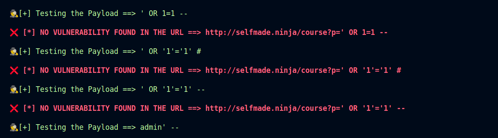

---

# 💉 MySQL Injection Tool


## 📄 Overview
The **MySQL Injection Tool** is a powerful and easy-to-use tool designed to automate the process of testing web applications for SQL injection vulnerabilities specifically targeting MySQL databases. Whether you're a security professional, penetration tester, or developer, this tool helps you quickly identify potential risks and vulnerabilities in web applications.

## 🛠 Features
- **Automates SQL injection testing**: Quickly test multiple payloads against a list of URLs to identify SQL injection vulnerabilities.
- **Supports multiple payloads**: Includes a set of common and effective SQL injection payloads.
- **Detailed Feedback**: Provides clear feedback on the vulnerability status of each URL and payload combination, including detected vulnerabilities like `SQL syntax errors`, `TIME-BASED SQL injection`, and `UNION-based SQL injection`.
- **User-friendly**: Easy to integrate and use, with a straightforward setup process.

## 📋 Prerequisites
Before using this tool, ensure you have the following prerequisites:
- Python 3.x installed on your system.
- The `requests,colorama,pyfiglet` Python library, which can be installed using:
  ```bash
  pip install requests
  pip install colorama
  pip isntall pyfiglet
  ```
if not working ?
  ```bash
  pip install --break-system-packages requests
  pip install --break-system-packages colorama
  pip isntall --break-system-packages pyfiglet
  ```

## 🛠 Installation
To install the MySQL Injection Tool:
1. Clone this repository or download the source code.
2. Ensure all prerequisites are met as mentioned in the prerequisites section.
3. Place the list of target URLs in a file named `sqli.txt` in the root directory.
4. Place the list of SQL injection payloads in a file named `SQL_payload.txt` in the root directory.


3. The tool will output the results for each URL with its corresponding payload, indicating potential vulnerabilities.

### Example Input Files
**sqli.txt:**
```
http://example.com/page1?p=
http://example.com/page2?p=
```

**SQL_payload.txt:**
```
' OR '1'='1 --
' OR '1'='1
' UNION SELECT
```

### Example Output
```plaintext
Testing the Payload ==> ' OR '1'='1 --
http://example.com/page1 🛑 Possible SQL Injection vulnerability found
✅ Payload => ' OR '1'='1 --
http://example.com/page2 🛑 Possible SQL Injection vulnerability found
✅ Payload => ' OR '1'='1
```



## 📝 Author
- **@balajih4kr** - A passionate cybersecurity enthusiast and developer.

## 🔐 License
This tool is licensed under the MIT License. See the LICENSE file for more details.

## 🛠 Support
For support or to report issues, please contact the author at `balaji@example.com`.

## 🎁 Acknowledgments
- Inspired by the need for quick and efficient SQL injection testing.
- Thanks to the Python requests library for simplifying HTTP requests.
- Thanks to the contributors for their support and feedback.

---

This version includes emojis to make it more engaging and easy to read, such as the 🚀 for Overview, 🛠 for Features, 📋 for Prerequisites, 🖥 for Installation and Usage, 📝 for Author, 🔐 for License, 🛠 for Support, and 🎁 for Acknowledgments. Adjust them further as per your preference!
