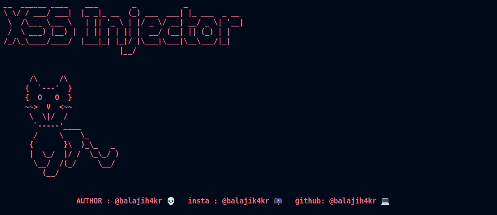

# XSS Hunter 🕵️‍♂️💥



**XSS Hunter** is an automated tool designed to find Cross-Site Scripting (XSS) vulnerabilities in web applications. The tool scans websites, extracting input fields and testing them for common and advanced XSS attack payloads. It is useful for penetration testers, security researchers, and bug bounty hunters to quickly identify and report XSS flaws.

---

## Features 🚀

- **Automated XSS Detection**: Scans websites and input fields to find potential XSS vulnerabilities.
- **Custom Payloads**: Includes a variety of XSS payloads to test forms and input fields.
- **Filter Bypass**: Includes advanced payloads designed to bypass common XSS filters.


---

## Installation 💻

Make sure you have **Python 3.x** installed on your machine. Then, install the required dependencies by following these steps:

1. Clone the repository:
   ```bash
   git clone https://github.com/your-username/xss_hunter.git
   cd xss_hunter

